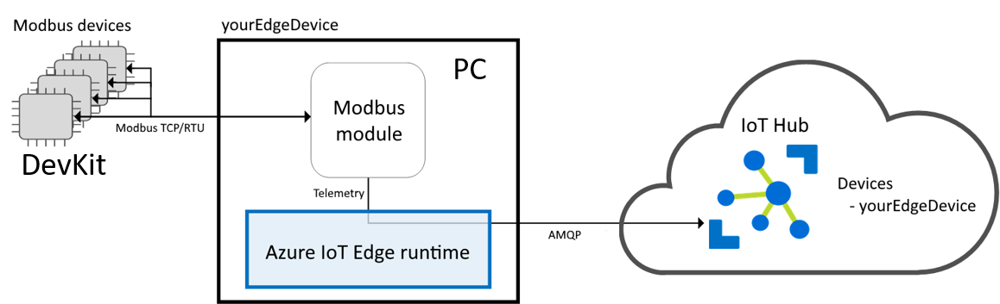

# Connect to IoT Edge device gateway as Modbus TCP device

Azure IoT Edge moves cloud analytics and custom business logic to devices so that your organization can focus on business insights instead of data management.

In this example, we will implement a simple Modbus TCP client on DevKit and use an IoT Edge device as a gateway. The gateway reads data from DevKit through Modbus TCP protocol, then communicates that data to the cloud using a supported protocol.




## Before you begin

To complete the steps in this tutorial, you need the following:

* An Azure IoT Edge device. For a walkthrough on how to set up one, see [Deploy Azure IoT Edge on a simulated device in Windows](https://docs.microsoft.com/en-us/azure/iot-edge/tutorial-simulate-device-windows) or [macOS](https://docs.microsoft.com/en-us/azure/iot-edge/tutorial-simulate-device-linux).
* Prepare your DevKit with [Getting Started Guide](https://microsoft.github.io/azure-iot-developer-kit/docs/get-started/) and upgrade to latest sdk (>=1.3.5).
* Upgrade to latest firmware (>= 1.3.0) with [Firmware Upgrading](https://microsoft.github.io/azure-iot-developer-kit/docs/firmware-upgrading/) tutorial.

## Setup device

1. Make sure `git` is installed on your machine and is added to the environment variables accessible to the command window. See [Software Freedom Conservancy's Git client tools](https://git-scm.com/download/) to have the latest version installed.

2. Open a command prompt. Clone the GitHub repo for DPS sample code:
  ```bash
  git clone https://github.com/DevKitExamples/DevKitModbus.git
  ```

3. Launch VS Code and connect DevKit to computer, open the folder that contains the code you cloned.

4. Use **Quick Open** in VS Code (Windows: `Ctrl+P`, macOS: `Cmd+P`) and type **>Arduino: Upload** to build and upload the code to the DevKit.

5. Observe the success of the upload in the output window. Record IPV4 address on DevKit screen.

## Update Edge Module setting

1. On the Azure portal, go to your IoT hub.
2. Go to IoT Edge (preview) and select your IoT Edge device created in [Before you begin](#before-you-begin).
3. Select Set modules.
4. Select module **tempSensor**:
    * Change **Image** field to `mcr.microsoft.com/azureiotedge/modbus:1.0`
    * Check the Enable box to update the module twin's desired properties.
    * Copy the following JSON into the text box. Change the value of SlaveConnection to the IPv4 address of DevKit.
    >```
    >{
    >  "properties.desired":{  
    >    "PublishInterval":"2000",
    >    "SlaveConfigs":{  
    >      "Slave01":{  
    >        "SlaveConnection":"<IPV4 address>",
    >        "HwId":"PowerMeter-0a:01:01:01:01:01",
    >        "Operations":{
    >          "Op01":{  
    >            "PollingInterval": "2000",
    >            "UnitId":"1",
    >            "StartAddress":"400001",
    >            "Count":"1",
    >            "DisplayName":"Temperature"
    >          },
    >          "Op02":{  
    >            "PollingInterval": "3000",
    >            "UnitId":"1",
    >            "StartAddress":"400002",
    >            "Count":"1",
    >            "DisplayName":"Humidity"
    >          }
    >        }
    >      }
    >    }
    >  }
    >}
    * Select Save.
5. Back in the Add Modules step, select Next.
6. In the Specify Routes step, select Next.
7. In the Review Template step, select Submit. 
Return to the device details page and select Refresh. You should see the new modbus running along with the IoT Edge runtime.

## View generated data
Monitor device to cloud messages sent from your IoT Edge device to your IoT hub: [View generated data](https://docs.microsoft.com/en-us/azure/iot-edge/tutorial-python-module#view-generated-data).
